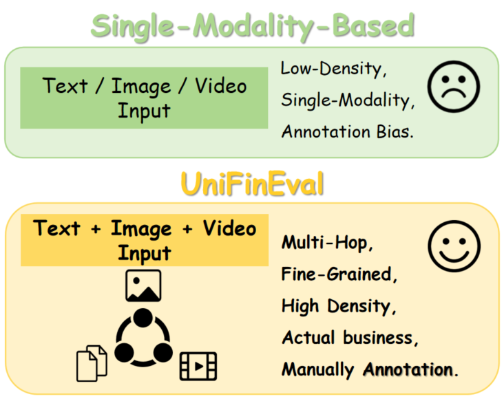
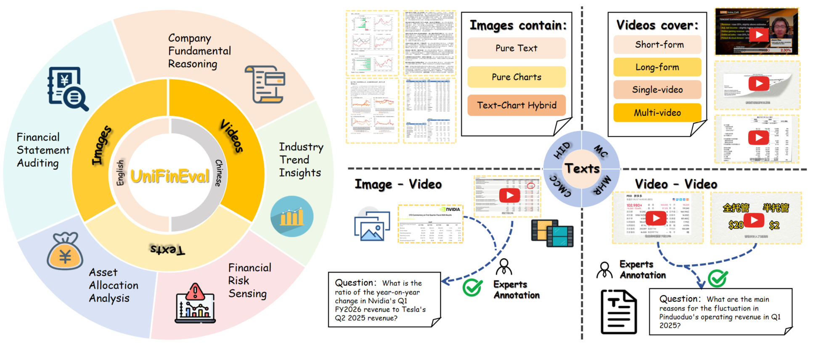
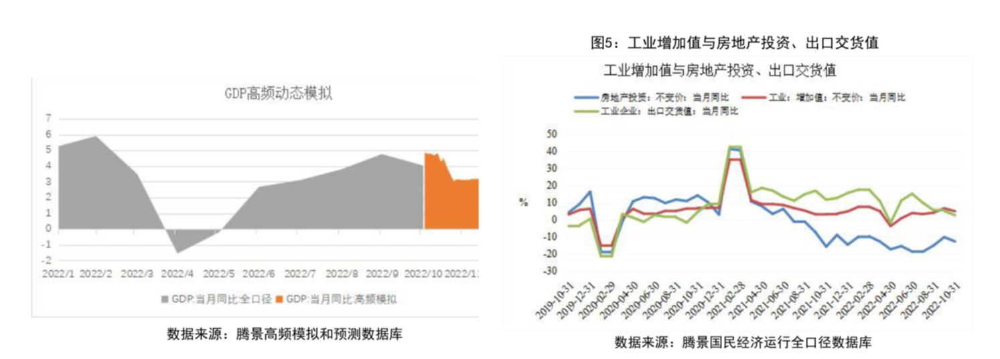
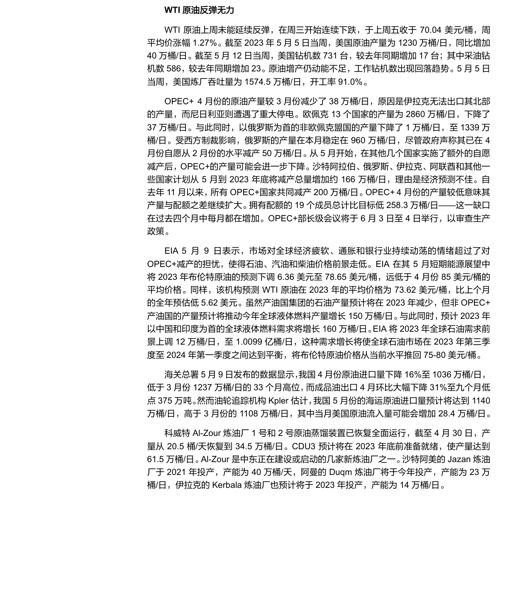
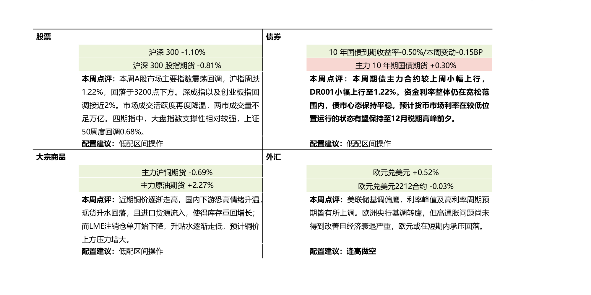

# UniFinEval: 面向文本、图像和视频的金融多模态模型统一评测基准

<div align="center">

[](https://arxiv.org/abs/2601.22162)
[](https://anonymous.4open.science/r/anonym4B75)
[](LICENSE)

**[English](README.md) | [简体中文](README_zh-CN.md)**

</div>

---

## 目录

- [1. 总览介绍 ](#总览介绍)
- [2. 五大金融场景 ](#五大金融场景)
- [3. 评测结果 ](#评测结果)
- [4. 使用指南 ](#使用指南)
- [5. 联系我们 ](#联系我们)

---

## 🏆 总览介绍 <a name="总览介绍"></a> 

**UniFinEval** 是首个专为**高信息密度（High-Information-Density, HID）**金融环境设计的统一多模态评测基准，旨在解决现有评测基准与真实金融业务脱节的问题。在真实的金融分析场景中，分析师不仅需要处理海量的研究报告和复杂的图表数据，还需要结合视频资讯进行连续的逻辑推导。为此，UniFinEval 引入了包含**文本、图像（高密度图表/文档）和视频**的全模态输入，构建了一个由 **3,767 个高质量问答对** 组成的数据集。所有数据均由持有 CFA/CPA 证书的金融专家手工构建并进行双盲交叉验证，确保了极高的业务专业性和逻辑严谨性 。

<div align="center">
  
  <br />
  <br /></div

        
为了全面测试模型在真实物理世界中的适应能力，UniFinEval 在数据模态上做出了重要创新。除了标准的**多模态融合**支持 Text-Image, Text-Video, Image-Video 等多种跨模态组合外，我们还特别引入了**环境扰动模拟（Environmental Perturbation）**机制。这意味着模型需要应对包括**污渍遮挡 (Stain)**、**透视形变 (Perspective)** 以及**折痕与弯曲 (Crease & Curvature)** 在内的多种视觉干扰，模拟真实文件流转中可能出现的低质量输入情况。这种设计使得 UniFinEval 能够从基础的信息提取到复杂的跨模态多跳推理（Multi-hop Reasoning），全方位地评估模型在噪点和干扰环境下的鲁棒性与决策能力。

 <div align="center">
  
  <br />
  <br /></div>

---

## 📈 五大金融场景 <a name="五大金融场景"></a> 

UniFinEval 依据真实的金融业务流程，构建了从基础信息认知到高阶决策制定的五个层级化场景。每个场景都设计了特定的难点，以全面评估 MLLMs 在复杂金融环境中的适应性。

### 1. 财务报表审计
* **场景深度解析:**
    这是金融分析的基础入口，核心目标是在高密度的视觉环境中验证财务信息的准确性与一致性。与传统数据集使用简化图表不同，FSA 场景保留了真实研报的复杂排版、页眉页脚及冗余干扰信息，以此模拟真实的审计环境。
* **考察能力:** 模型不仅需要进行单点的事实检索，还需要跨越多个页面进行多跳推理（Multi-hop Reasoning），在含有视觉噪声的文档中精准定位并核对关键财务指标，这直接考验了模型在复杂布局下的细粒度感知能力。
* **示例说明:**
*在此示例中，模型需要阅读长篇文本并结合复杂的趋势图，定位特定年份“房地产投资增速”进入两位数负增长的具体月份，并进行跨模态的数据验证。*
 <div align="center">
  
  <br />
  <br /></div>

```
文本：工业生产稳中向好，计算机通信动能较强腾景全口径数据显示，工业经济运行相对平稳，1-10月工业增加值不变价累计同比增速为3.8\%,其中4月份受到疫情冲击影响，增速落入负向区间(-3.9\%),而后触底反弹、保持微幅上行态势。其中，房地产投资、出口交货值与工业增加值同比增速走势契合度较高，但在2021年5月出现K形分化走势，今年K形分化程度进一步加深，具体表现在房地产投资增速自去年7月份落入负向区间后，不断向下走阔， 持续两位数的负增长低迷状态，阻碍工业修复。
问题1：依据文本中关于房地产投资增速的描述，其进入持续两位数负增长区间的起始月份是哪个月？
答案：2021年7月
问题2：结合确定的起始月份和图5中显示的最新数据点，计算房地产投资增速处于两位数负增长状态的总月份数。
答案：16
```
  
### 2. 公司基本面推理
* **场景深度解析:**
    在完成基础审计后，分析工作进入对企业经营状况和内在价值的深度剖析阶段。该场景侧重于信息对齐与语义同步，模型需要处理来自不同来源（如财报与第三方研报）的异构数据。
* **考察能力:** 这里的图表不再直接给出答案，而是通过趋势或相对变化传达隐含信息。模型必须从多源文本和图表中提取分散的参数，执行严谨的金融公式计算（如推导 EBITDA 利润率或营收复合增长率），从而区分单纯的信息检索能力与深度的金融逻辑推理能力。
* **示例说明:**
*模型需结合视频中披露的市场动态和财报图表中的具体数值，通过多步计算推导出腾讯公司特定季度的营收增速与预测值的差异。*
 <div align="center">
  
  <br />
  <br /></div>

```
问题：世界上规模最快突破两百亿美元的主动管理型ETF的股息与美盈森的差值是多少？
答案：-6.19%
问题2：结合确定的起始月份和图5中显示的最新数据点，计算房地产投资增速处于两位数负增长状态的总月份数。
答案：16
```
  
### 3. 行业趋势洞察 (Industry Trend Insights, ITI)
* **场景深度解析:**
    分析视角从单一企业上升至行业维度，关注跨企业对比与跨周期分析。该场景模拟了分析师如何从碎片化的信息中拼凑出行业全貌，数据源涵盖多期财报、行业研报及宏观经济数据。
* **考察能力:** 任务要求模型不仅能理解单一图表，还要能综合多份文档中的异构数据，识别行业发展的底层逻辑（如周期性波动、竞争格局变化）。模型需要展现出强大的跨文档信息聚合能力和长程逻辑归纳能力。
* **示例说明:**
 *模型需综合宏观经济视频分析和多份行业研报的文字描述，推断在“大周期”模型下，某一核心指标（如金融中心地位）在顶峰后的衰退特征。*
 <div align="center">
  
  <br />
  <br /></div>

```
文本：As I described in my book Principles for Dealing with the Changing World Order, I automated my way looking at the cause effect relationships that are driving both improvements in and worsenings of countries’ conditions so that data is fed into a computer that analyzes it and writes a summary of the current conditions and the long-term prospects for each country.  ... ... The table below shows our aggregate country power gauge and the major drivers, as well as the rank of each measure of power across 24 major countries today and the trajectory over the past twenty years. To understand a country, we start by looking at the big cycles , as well as measures of power that both reflect and drive the rise and fall of a country. While we refer to these factors individually, they are not separate; they interact with and reinforce one another to move a country along its cycle. For the United States, the big cycles look mostly unfavorable. The United States is in an unfavorable position in its economic and financial cycles, with a high debt burden and relatively low expected real growth over the next 10 years (1.3\% per year). The United States has significantly more foreign debts than foreign assets (net IIP is -68\% of GDP). Non-financial debt levels are high (274\% of GDP), and government debt levels are high (127\% of GDP). The bulk (99\%) of these debts are in its own currency, which mitigates its debt risks. The ability to use interest rate cuts to stimulate the economy is low (short rates at 0.1\%), and the country is already printing money to monetize debt. That said, being the world’s leading reserve currency is a large benefit to the US. If this were to change, it would significantly weaken the US position. Internal disorder is a high risk. Wealth, income, and values gaps are large (relative to countries of similar per capita income levels). Regarding Inequality—the top 1\% and top 10\% in the United States capture 19\% and 45\% of income (respectively the 8th and 11th highest share across major countries). ... ..., Half of the measure captures the absolute quantity of educated people at various levels and about half is placed on quality such as higher education rankings, test scores, and average years of education. The US ranks highest in this gauge (driven by strong absolute and relative measures of higher education), with China close behind (due to its large number of educated people). Financial Center:  This gauge measures the level of development and sizes of a country’s financial markets and financial center. We look at absolute measures of transaction shares and market capitalizations, as well as external indices of financial center cities. The US remains the top-ranked power in this metric by a significant margin (driven primarily by its very large share of world equity and debt mar -kets), with China and Europe ranking second and third, respectively. Reserve Currency Status: This gauge measures the extent to which a country’s currency operates as a global reserve currency. We measure reserve currency status by the share of transactions, debts, and central bank reserves that are denominated or held in a country’s currency. Similar to financial center status, the US remains the top-ranked power in this metric by a significant margin, with Europe and Japan ranking second and third, respectively. ... ..., In case it is helpful or interesting to you, you can review those scores below.33 In a few cases where there were no quality measures, I had to create quality measures by adjusting the quantity for a country’s population, turning it into a per capita measure. We did not give reserve currency status scores to the countries that share the euro, which is why those measures are displayed as dashes. 4 Because the notion of competitiveness is inherently relative, we only show the total score for this measure.
问题：Synthesizing the analytical logic regarding the 'Big Cycle' and the 'Eight Major Strengths' in the text, as well as the average evolutionary trends of the 'Eight Major Strengths' for all empires before and after their respective peaks as shown in Figure 5, please infer: After an empire's power reaches its peak, which 'strength' indicator declines the fastest (i.e., requires the shortest time to drop from its peak to the 0.2 level)? Please substantiate your argument by combining the trend lines in the video with the implications in the text regarding the vulnerability of 'financial center' status.
答案：Financial Center
```
  
### 4. 金融风险感知 (Financial Risk Sensing, FRS)
* **场景深度解析:**
    此场景聚焦于多维度识别潜在的下行风险信号，是保障投资安全的关键环节。FRS 是 UniFinEval 中引入动态视频模态的核心场景，因为现实中的风险信号往往隐藏在时变的、非结构化的新闻资讯或分析视频中。
    * **考察能力:** 模型需要将视频中专家的动态观点与静态报告中的量化数据进行显式对齐。这要求模型具备处理时序信息的能力，能够捕捉市场情绪的变化，并判断这些非结构化线索如何影响具体的财务预测（如油价波动、营收下滑风险）。
* **示例说明:**
*结合 OPEC+ 减产计划的文本数据与 EIA 视频中关于全球经济情绪的负面评估，分析为何在减产背景下油价预测依然被下调，识别隐含的宏观衰退风险。*
 <div align="center">
  
  <br />
  <br /></div>

```
问题：结合OPEC+ 4月份实际减产数据、5月到年底的计划减产总量，以及EIA对全球经济情绪的评估，分析EIA下调2023年WTI原油平均价格预测的核心原因，并指出该原因如何导致OPEC+减产对价格的支撑作用被削弱。
答案：市场对全球经济疲软、通胀和银行业动荡的情绪超过了对OPEC+减产的担忧；经济担忧抵消了减产效果，使价格预期下调
```
  
### 5. 资产配置分析 (Asset Allocation Analysis, AAA)
* **场景深度解析:**
    作为金融业务流的终极决策阶段，AAA 场景要求综合前序所有阶段的分析成果，在多重现实约束（如政策限制、风险偏好）下制定可执行的策略。这是本基准中输入结构最复杂、信息密度最高的任务。
* **考察能力:** 任务通常采用多轮对话形式，要求模型在交互中不断整合新信息，平衡收益与风险，并在高维度的信息空间中保持决策逻辑的一致性。这直接评估了 MLLMs 是否具备辅助专家进行核心投资决策的潜力。
* **示例说明:**
*基于对市场波动背景（图表）和央行资金投放政策（文本）的综合理解，量化计算资金投放倍数，并据此给出具体的“高配”或“低配”操作建议。*
 <div align="center">
  
  <br />
  <br /></div>

```
问题：基于文字说明中'随后两个交易日内保持日均1000亿元左右的投放规模'的表述，以及图表25所反映的2022年11月市场波动背景，计算从操作当日到后续两个交易日的总投放规模相对于当日净投放额的倍数（保留两位小数）
答案：1.39
```
  
---

## 📊 评测结果 <a name="评测结果"></a> 
### 结果分析
我们选取了 10 个主流 MLLMs 进行评测，包括闭源模型（如 Gemini-3-pro-preview, GPT-5.1）和开源模型（如 Qwen3-VL, InternVL3.5）。实验结果表明，尽管如Gemini-3-pro-preview这样的顶尖模型在总分上取得了 73.8% 的准确率，但与人类专家（91.3%）相比仍存在显著差距，这一差距在不同任务难度上表现出明显的梯度衰减特征：

1.  **感知与决策的断层：** 模型在信息感知类任务（如 FSA 和 CFR）上表现较好，能够准确提取图表和文本中的关键信息，与人类差距较小。然而，随着任务复杂度提升至高阶决策（如 AAA），所有模型的性能均出现大幅下滑。在资产配置分析任务中，Gemini-3-pro-preview 仅获得 61.1% 的准确率，远低于专家的 85.2% 。
2.  **长链路推理的挑战：** 结果揭示了模型在处理高信息密度和多模态融合时的局限性。模型在需要维持长期逻辑一致性和处理复杂约束条件的场景下（如 ITI 和 AAA），难以构建稳定的语义映射，导致决策逻辑的崩塌。
3.  **视频模态的短板：** 在引入视频信息的 FRS（金融风险感知）任务中，大多数模型未能实现性能突破，暴露了当前 MLLMs 在跨时间维度的逻辑建模能力上仍有不足。

| Model | FSA<br>Zero-Shot | FSA<br>CoT | CFR<br>Zero-Shot | CFR<br>CoT | ITI<br>Zero-Shot | ITI<br>CoT | FRS<br>Zero-Shot | FRS<br>CoT | AAA<br>Zero-Shot | AAA<br>CoT | Average<br>Zero-Shot | Average<br>CoT |
| :--- | :---: | :---: | :---: | :---: | :---: | :---: | :---: | :---: | :---: | :---: | :---: | :---: |
| **Gemini-3-pro-preview** | **83.5** | **83.8** | **82.2** | **82.8** | **73.3** | **74.7** | **68.8** | **70.1** | **61.1** | **55.4** | **73.8** | **73.4** |
| Qwen3-VL-235B-A22B-Thinking | <u>80.2</u> | <u>81.3</u> | <u>78.9</u> | <u>74.9</u> | <u>69.4</u> | 64.6 | <u>62.9</u> | <u>62.7</u> | 43.3 | <u>50.3</u> | <u>66.9</u> | <u>66.8</u> |
| Qwen3-VL-32B-Thinking | 75.1 | 76.2 | 71.0 | 70.3 | 65.6 | <u>65.2</u> | 54.8 | 56.6 | 40.8 | 43.3 | 61.5 | 62.3 |
| GPT-5.1 | 76.9 | 77.8 | 67.1 | 65.0 | 65.8 | 60.4 | 50.0 | 54.1 | <u>47.8</u> | 48.4 | 61.5 | 61.1 |
| Claude-Sonnet-4.5 | 70.8 | 71.9 | 65.4 | 68.2 | 61.7 | 61.4 | 50.0 | 50.6 | 40.8 | 42.0 | 57.7 | 58.6 |
| InternVL3.5-241B-A28B | 69.0 | 70.6 | 66.2 | 68.7 | 63.8 | 63.8 | 37.1 | 36.2 | 38.2 | 40.1 | 54.9 | 55.9 |
| MiniCPM-V-4.5 | 65.9 | 66.2 | 62.3 | 64.1 | 53.2 | 57.9 | 30.6 | 38.0 | 33.1 | 29.9 | 49.0 | 51.2 |
| InternVL3.5-30B-A3B | 61.5 | 61.7 | 64.7 | 59.9 | 50.0 | 52.7 | 33.9 | 35.8 | 28.0 | 34.4 | 47.6 | 49.0 |
| Grok-4.1-Fast-Reasoning | 50.3 | 52.5 | 43.1 | 44.1 | 32.5 | 34.9 | 16.1 | 19.3 | 17.8 | 22.3 | 32.0 | 34.6 |
| Llama-3.2-11B-Vision | 22.2 | 23.1 | 20.9 | 23.7 | 19.0 | 21.4 | 14.1 | 15.7 | 11.5 | 10.8 | 17.5 | 18.9 |
| **Expert** | 97.5 | | 95.3 | | 90.1 | | 88.5 | | 85.2 | | 91.3 | |

---


## 🚀 使用指南 <a name="使用指南"></a> 

### Prerequisites

- Python 3.8 or higher
- pip package manager

### Installation

1. **Clone the repository**
   ```bash
   git clone https://github.com/your-repo/unifineval.git
   cd unifineval
   ```

2. **Install dependencies**
   ```bash
   pip install -r requirements.txt
   ```

3. **Configure environment variables**
   ```bash
   cp env.example .env
   # Edit .env file with your API keys and configuration
   ```

### Basic Usage

1. **Prepare your dataset**
   - Format your data according to the [Input Format Requirements](evaluate_py/输入格式要求.md)
   - Supported formats: JSON, JSONL, CSV, Excel (.xlsx/.xls)

2. **Run evaluation**
   ```bash
   python -m evaluate_py.main \
       --input_file ./data/your_dataset.json \
       --output_file eval_results.json \
       --log_dir ./logs \
       --log_level INFO
   ```

3. **Using shell script (recommended)**
   ```bash
   # Edit evaluate.sh to configure your settings
   bash evaluate.sh
   ```

---

## 📋 Configuration

### Environment Variables

Create a `.env` file in the project root with the following variables:

```bash
# API Keys for different providers
api1=your_dashscope_api_key      # Alibaba Cloud DashScope
api2=your_volces_api_key          # ByteDance Volces
api3=your_openrouter_api_key      # OpenRouter
api4=your_siliconflow_api_key     # SiliconFlow

# Models to evaluate (comma-separated)
EVAL_MODELS=model1,model2,model3

# Local inference service configuration (if using local models)
LOCAL_8000_HOST=localhost
LOCAL_8000_PORT=8000
```

See [env.example](env.example) for a complete template.

### Model Configuration

Models are configured in `evaluate_py/config.py`. You can add new models by modifying the `MODEL_DEFINITIONS` dictionary:

```python
MODEL_DEFINITIONS = {
    "your-model-name": {
        "base_url_key": "dashscope",  # or "volces", "openrouter", etc.
        "model": "your-model-id",
        "max_tokens": 25000,
        "timeout": 1200,
        "enable_thinking": True,
        "extra_body": {}
    }
}
```


## 📁 Project Structure

```
unifineval/
├── evaluate_py/              # Core evaluation framework
│   ├── __init__.py
│   ├── main.py              # Main entry point
│   ├── config.py            # Configuration management
│   ├── data_loader.py       # Data loading utilities
│   ├── evaluator.py         # Core evaluation logic
│   ├── model_api.py         # Model API integration
│   ├── judge.py             # Answer judging logic
│   ├── prompts.py           # Prompt templates
│   ├── statistics.py        # Statistical analysis
│   └── ...
├── outputs/                 # Evaluation results (auto-generated)
│   └── {profile}/
│       └── {model_name}/
│           └── *.json
├── logs/                    # Log files (auto-generated)
├── env.example             # Environment variable template
├── requirements.txt        # Python dependencies
├── README.md               # This file (English)
├── README_CN.md            # Chinese documentation
└── evaluate.sh             # Example evaluation script
```

---

## 🔧 Advanced Usage

### Multi-Round Dialogue Evaluation

The framework automatically detects and handles multi-round dialogues. Ensure your data follows the format:

```json
{
  "question_id": "q001",
  "question": {
    "round1": "First question...",
    "round2": "Follow-up question..."
  },
  "answer": {
    "round1": "First answer...",
    "round2": "Follow-up answer..."
  }
}
```

### Resume Evaluation

To resume a previous evaluation:

```bash
python -m evaluate_py.main \
    --input_file ./data/dataset.json \
    --output_file eval_results.json \
    --resume
```

### Custom Output Format

Results are saved in JSON or JSONL format:

- **JSON**: Single file with all results and statistics
- **JSONL**: Line-delimited format, one result per line

Specify format via output file extension:

```bash
--output_file results.json    # JSON format
--output_file results.jsonl   # JSONL format
```

### Image Handling

The framework supports:
- Local image paths
- Image URLs (http/https)
- Multiple images per question
- Automatic image compression for token optimization

---

## 📈 Output Format

Evaluation results include:

```json
{
  "statistics": {
    "total": {
      "total_count": 100,
      "correct_count": 85,
      "accuracy": 0.85
    },
    "by_model": {...},
    "by_profile": {...},
    "by_category": {...}
  },
  "results": [
    {
      "question_id": "q001",
      "question_type": "单选题",
      "profiles": {
        "expert": {
          "models": {
            "model-name": {
              "is_correct": true,
              "extracted_answer": "...",
              "response_time": 2.5,
              ...
            }
          }
        }
      }
    }
  ]
}
```

---

## 🧪 Testing

Run tests to verify installation:

```bash
python -m pytest tests/
```

---

## 📝 Citation

If you use UniFinEval in your research, please cite:

```bibtex
@article{unifineval2024,
  title={UniFinEval: A Unified Evaluation Framework for Financial Vision-Language Models},
  author={Your Name and Collaborators},
  journal={arXiv preprint arXiv:XXXX.XXXXX},
  year={2024}
}
```

---

## 🤝 Contributing

Contributions are welcome! Please feel free to submit a Pull Request.

1. Fork the repository
2. Create your feature branch (`git checkout -b feature/AmazingFeature`)
3. Commit your changes (`git commit -m 'Add some AmazingFeature'`)
4. Push to the branch (`git push origin feature/AmazingFeature`)
5. Open a Pull Request

---

## 📫 联系我们 <a name="联系我们"></a>
诚邀业界同仁共同探索 AI 与金融深度融合的创新范式，共建智慧金融新生态，并通过邮件与zhang.liwen@shufe.edu.cn联系

