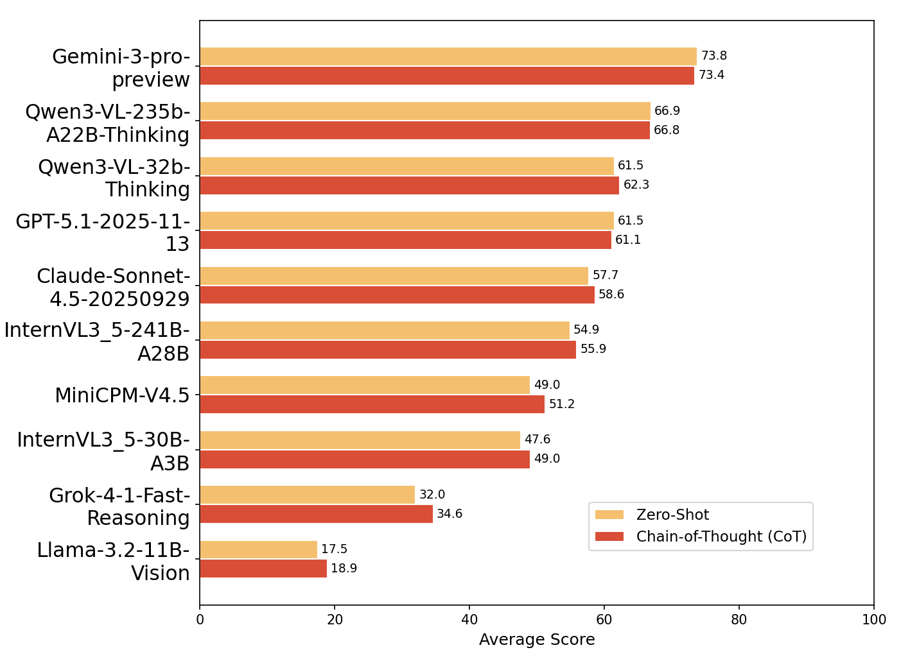

<div align="center">
    <h1>UniFinEval: owards Unified Evaluation of Financial Multimodal Models across Text, Images and Videos</h1>

<!-- 链接和数据 -->
[](https://arxiv.org/abs/2601.22162)
[](https://anonymous.4open.science/r/anonym4B75)
[](LICENSE)

<!-- 语言切换链接 -->
[English](README.md) | [简体中文](README_CN.md)
</div>

 <div align="center">
  
  <br />
  <br /></div>

---

## Contents

- [1. Overview](#overview)
- [2. Five Financial Scenarios](#five-financial-scenarios)
- [3. Evaluation Results](#evaluation-results)
- [4. User Guide](#user-guide)
- [5. Contact Us](#contact-us)
- [6. Citation](#citation)

---

## 🏆 Overview <a name="overview"></a> 

**UniFinEval** is the first unified multimodal evaluation benchmark designed specifically for high-information-density financial environments. It aims to bridge the gap between existing benchmarks and real-world financial operations. In actual financial analysis scenarios, analysts must not only process massive amounts of research reports and complex chart data but also combine video news for continuous logical deduction. To this end, UniFinEval introduces full-modality inputs containing information-dense text, images, and video, constructing a dataset of **3,767 high-quality Q&A pairs**. All data was manually constructed and subjected to blind cross-validation by financial experts holding CFA/CPA certificates to ensure extreme professional relevance and logical rigor.

<div align="center">
  
  <br />
  <br /></div

        
To comprehensively test model adaptability in the real physical world, UniFinEval goes beyond standard multimodal fusion (supporting Text-Image, Text-Video, Image-Video, etc.) by specifically introducing **environmental perturbation simulation mechanisms**. This means models must cope with various visual interferences that may occur in real environments, simulating low-quality inputs found in real-world document circulation. This design enables UniFinEval to comprehensively evaluate model robustness and decision-making capabilities in noisy and interfering environments, ranging from basic information extraction to complex cross-modal multi-hop reasoning. Below is an example of solving a problem combining three modalities.

 <div align="center">
  
  <br />
  <br /></div>

---

## 📈 Five Financial Scenarios <a name="five-financial-scenarios"></a> 

Based on real financial business processes, UniFinEval constructs five hierarchical scenarios ranging from basic information cognition to high-level decision-making. Each scenario is designed with specific challenges to fully assess the adaptability of MLLMs in complex financial environments. The distribution of questions across financial scenarios is shown below.

| Financial Scenario | Questions |
| :--- | :---: |
| Financial Statement Auditing | 892 |
| Company Fundamental Reasoning | 926 |
| Industry Trend Insights | 896 |
| Financial Risk Sensing | 535 |
| Asset Allocation Analysis | 518 |
| **Total (UniFinEval)** | **3767** |

### 1. Financial Statement Auditing (FSA)
Scenario Deep Dive: This is the entry point for financial analysis. The core objective is to verify the accuracy and consistency of financial information within a high-density visual environment. Unlike traditional datasets that use simplified charts, the FSA scenario retains the complex layout, headers, footers, and redundant interference information of real research reports to simulate a genuine auditing environment.
Capabilities Tested: The model needs to perform not only single-point fact retrieval but also Multi-hop Reasoning across multiple pages. It must precisely locate and verify key financial indicators in documents containing visual noise, directly testing the model's fine-grained perception capabilities under complex layouts.
Example: In this example, the model needs to read a long text and combine it with a complex trend chart to locate the specific month in a given year when the "real estate investment growth rate" entered double-digit negative growth, and then perform cross-modal data verification.
 <div align="center">
  
  <br />
  <br /></div>

```
文本：工业生产稳中向好，计算机通信动能较强腾景全口径数据显示，工业经济运行相对平稳，1-10月工业增加值不变价累计同比增速为3.8\%,其中4月份受到疫情冲击影响，增速落入负向区间(-3.9\%),而后触底反弹、保持微幅上行态势。其中，房地产投资、出口交货值与工业增加值同比增速走势契合度较高，但在2021年5月出现K形分化走势，今年K形分化程度进一步加深，具体表现在房地产投资增速自去年7月份落入负向区间后，不断向下走阔， 持续两位数的负增长低迷状态，阻碍工业修复。
问题1：依据文本中关于房地产投资增速的描述，其进入持续两位数负增长区间的起始月份是哪个月？
答案：2021年7月
问题2：结合确定的起始月份和图5中显示的最新数据点，计算房地产投资增速处于两位数负增长状态的总月份数。
答案：16
```
  
### 2. Company Fundamental Reasoning (CFR)
Scenario Deep Dive: After completing the basic audit, the analysis moves to a deep dissection of the enterprise's operating status and intrinsic value. This scenario focuses on information alignment and semantic synchronization, requiring the model to handle heterogeneous data from different sources (e.g., financial reports vs. third-party research reports).
Capabilities Tested: The charts here no longer provide direct answers but convey implicit information through trends or relative changes. The model must extract scattered parameters from multi-source texts and charts to execute rigorous financial formula calculations (such as deriving EBITDA margins or CAGR), thereby distinguishing simple information retrieval capabilities from deep financial logical reasoning capabilities.
Example: The model needs to combine market dynamics disclosed in a video with specific figures in financial report charts to derive the difference between Tencent's revenue growth rate and the forecast value for a specific quarter through multi-step calculation.
 <div align="center">
  
  <br />
  <br /></div>

```
问题：世界上规模最快突破两百亿美元的主动管理型ETF的股息与美盈森的差值是多少？
答案：-6.19%
问题2：结合确定的起始月份和图5中显示的最新数据点，计算房地产投资增速处于两位数负增长状态的总月份数。
答案：16
```
  
### 3. Industry Trend Insights (ITI)
Scenario Deep Dive: The analytical perspective rises from a single enterprise to the industry dimension, focusing on cross-enterprise comparison and cross-cycle analysis. This scenario simulates how analysts piece together a complete industry picture from fragmented information, with data sources covering multiple periods of financial reports, industry research reports, and macroeconomic data.
Capabilities Tested: The task requires the model to not only understand single charts but also synthesize heterogeneous data from multiple documents to identify the underlying logic of industry development (such as cyclical fluctuations and changes in the competitive landscape). The model needs to demonstrate strong cross-document information aggregation capabilities and long-range logical induction capabilities.
Example: The model needs to synthesize macroeconomic video analysis and text descriptions from multiple industry reports to infer the recession characteristics of a core indicator (such as financial center status) after its peak under the "Big Cycle" model.
 <div align="center">
  
  <br />
  <br /></div>

```
文本：As I described in my book Principles for Dealing with the Changing World Order, I automated my way looking at the cause effect relationships that are driving both improvements in and worsenings of countries’ conditions so that data is fed into a computer that analyzes it and writes a summary of the current conditions and the long-term prospects for each country.  ... ... The table below shows our aggregate country power gauge and the major drivers, as well as the rank of each measure of power across 24 major countries today and the trajectory over the past twenty years. To understand a country, we start by looking at the big cycles , as well as measures of power that both reflect and drive the rise and fall of a country. While we refer to these factors individually, they are not separate; they interact with and reinforce one another to move a country along its cycle. For the United States, the big cycles look mostly unfavorable. The United States is in an unfavorable position in its economic and financial cycles, with a high debt burden and relatively low expected real growth over the next 10 years (1.3\% per year). The United States has significantly more foreign debts than foreign assets (net IIP is -68\% of GDP). Non-financial debt levels are high (274\% of GDP), and government debt levels are high (127\% of GDP). The bulk (99\%) of these debts are in its own currency, which mitigates its debt risks. The ability to use interest rate cuts to stimulate the economy is low (short rates at 0.1\%), and the country is already printing money to monetize debt. That said, being the world’s leading reserve currency is a large benefit to the US. If this were to change, it would significantly weaken the US position. Internal disorder is a high risk. Wealth, income, and values gaps are large (relative to countries of similar per capita income levels). Regarding Inequality—the top 1\% and top 10\% in the United States capture 19\% and 45\% of income (respectively the 8th and 11th highest share across major countries). ... ..., Half of the measure captures the absolute quantity of educated people at various levels and about half is placed on quality such as higher education rankings, test scores, and average years of education. The US ranks highest in this gauge (driven by strong absolute and relative measures of higher education), with China close behind (due to its large number of educated people). Financial Center:  This gauge measures the level of development and sizes of a country’s financial markets and financial center. We look at absolute measures of transaction shares and market capitalizations, as well as external indices of financial center cities. The US remains the top-ranked power in this metric by a significant margin (driven primarily by its very large share of world equity and debt mar -kets), with China and Europe ranking second and third, respectively. Reserve Currency Status: This gauge measures the extent to which a country’s currency operates as a global reserve currency. We measure reserve currency status by the share of transactions, debts, and central bank reserves that are denominated or held in a country’s currency. Similar to financial center status, the US remains the top-ranked power in this metric by a significant margin, with Europe and Japan ranking second and third, respectively. ... ..., In case it is helpful or interesting to you, you can review those scores below.33 In a few cases where there were no quality measures, I had to create quality measures by adjusting the quantity for a country’s population, turning it into a per capita measure. We did not give reserve currency status scores to the countries that share the euro, which is why those measures are displayed as dashes. 4 Because the notion of competitiveness is inherently relative, we only show the total score for this measure.
问题：Synthesizing the analytical logic regarding the 'Big Cycle' and the 'Eight Major Strengths' in the text, as well as the average evolutionary trends of the 'Eight Major Strengths' for all empires before and after their respective peaks as shown in Figure 5, please infer: After an empire's power reaches its peak, which 'strength' indicator declines the fastest (i.e., requires the shortest time to drop from its peak to the 0.2 level)? Please substantiate your argument by combining the trend lines in the video with the implications in the text regarding the vulnerability of 'financial center' status.
答案：Financial Center
```
  
### 4. Financial Risk Sensing (FRS)
Scenario Deep Dive: This scenario focuses on multidimensional identification of potential downside risk signals, which is key to investment security. FRS is the core scenario in UniFinEval that introduces the dynamic video modality, as real-world risk signals are often hidden in time-variant, unstructured news feeds or analytical videos.
Capabilities Tested: The model needs to explicitly align dynamic opinions in videos with quantitative data in static reports. This requires the model to handle sequential information, capture changes in market sentiment, and determine how these unstructured cues affect specific financial forecasts (e.g., oil price fluctuations, revenue decline risks).
Example: Combine text data on the OPEC+ production cut plan with negative assessments of global economic sentiment in an EIA video to analyze why oil price forecasts were downgraded despite the production cuts, identifying implicit macro-recession risks.
 <div align="center">
  
  <br />
  <br /></div>

```
问题：结合OPEC+ 4月份实际减产数据、5月到年底的计划减产总量，以及EIA对全球经济情绪的评估，分析EIA下调2023年WTI原油平均价格预测的核心原因，并指出该原因如何导致OPEC+减产对价格的支撑作用被削弱。
答案：市场对全球经济疲软、通胀和银行业动荡的情绪超过了对OPEC+减产的担忧；经济担忧抵消了减产效果，使价格预期下调
```
  
### 5. Asset Allocation Analysis (AAA)
Scenario Deep Dive: As the ultimate decision-making stage in the financial workflow, the AAA scenario requires synthesizing analysis results from all preceding stages to formulate executable strategies under multiple real-world constraints (e.g., policy restrictions, risk appetite). This is the task with the most complex input structure and highest information density in the benchmark.
Capabilities Tested:** The task typically takes the form of multi-turn dialogue, requiring the model to continuously integrate new information, balance risk and return, and maintain consistent decision logic within a high-dimensional information space during the interaction. This directly evaluates whether MLLMs have the potential to assist experts in core investment decision-making.
Example: Based on a comprehensive understanding of the market volatility background (charts) and central bank funding policies (text), quantitatively calculate the funding injection multiplier and provide specific "overweight" or "underweight" operational recommendations.
 <div align="center">
  
  <br />
  <br /></div>

```
问题：基于文字说明中'随后两个交易日内保持日均1000亿元左右的投放规模'的表述，以及图表25所反映的2022年11月市场波动背景，计算从操作当日到后续两个交易日的总投放规模相对于当日净投放额的倍数（保留两位小数）
答案：1.39
```
  
---

## 📊 Evaluation Results <a name="evaluation-results"></a>
### Result Analysis
We selected 10 mainstream MLLMs for evaluation, including 4 closed-source models and 6 open-source models, under both Zero-shot and CoT (Chain of Thought) settings across the five major scenarios. Experimental results show that although top-tier models like Gemini-3-pro-preview achieved an overall accuracy of 73.8%, there is still a significant gap compared to human experts (91.3%). This gap exhibits distinct gradient decay characteristics across different task difficulties:

1.  The Fault Line in Perception and Decision: Models perform relatively well on information perception tasks (such as FSA and CFR), accurately extracting key information from charts and texts with a small gap compared to humans. However, as task complexity rises to high-level decision-making (such as AAA), the performance of all models drops significantly. In the Asset Allocation Analysis task, Gemini-3-pro-preview only achieved 61.1% accuracy, far below the expert level of 85.2%.
2.  Challenges in Long-Chain Reasoning: The results reveal the limitations of models in handling high information density and multimodal fusion. In scenarios requiring the maintenance of long-term logical consistency and handling complex constraints (such as ITI and AAA), models struggle to build stable semantic mappings, leading to the collapse of decision logic.
3.  Shortcomings in the Video Modality: In the FRS (Financial Risk Sensing) task involving video information, most models failed to achieve a performance breakthrough, exposing current deficiencies in the logical modeling capabilities of MLLMs across the temporal dimension.

| Model | FSA<br>Zero-Shot | FSA<br>CoT | CFR<br>Zero-Shot | CFR<br>CoT | ITI<br>Zero-Shot | ITI<br>CoT | FRS<br>Zero-Shot | FRS<br>CoT | AAA<br>Zero-Shot | AAA<br>CoT | Average<br>Zero-Shot | Average<br>CoT |
| :--- | :---: | :---: | :---: | :---: | :---: | :---: | :---: | :---: | :---: | :---: | :---: | :---: |
| **Gemini-3-pro-preview** | **83.5** | **83.8** | **82.2** | **82.8** | **73.3** | **74.7** | **68.8** | **70.1** | **61.1** | **55.4** | **73.8** | **73.4** |
| Qwen3-VL-235B-A22B-Thinking | <u>80.2</u> | <u>81.3</u> | <u>78.9</u> | <u>74.9</u> | <u>69.4</u> | 64.6 | <u>62.9</u> | <u>62.7</u> | 43.3 | <u>50.3</u> | <u>66.9</u> | <u>66.8</u> |
| Qwen3-VL-32B-Thinking | 75.1 | 76.2 | 71.0 | 70.3 | 65.6 | <u>65.2</u> | 54.8 | 56.6 | 40.8 | 43.3 | 61.5 | 62.3 |
| GPT-5.1 | 76.9 | 77.8 | 67.1 | 65.0 | 65.8 | 60.4 | 50.0 | 54.1 | <u>47.8</u> | 48.4 | 61.5 | 61.1 |
| Claude-Sonnet-4.5 | 70.8 | 71.9 | 65.4 | 68.2 | 61.7 | 61.4 | 50.0 | 50.6 | 40.8 | 42.0 | 57.7 | 58.6 |
| InternVL3.5-241B-A28B | 69.0 | 70.6 | 66.2 | 68.7 | 63.8 | 63.8 | 37.1 | 36.2 | 38.2 | 40.1 | 54.9 | 55.9 |
| MiniCPM-V-4.5 | 65.9 | 66.2 | 62.3 | 64.1 | 53.2 | 57.9 | 30.6 | 38.0 | 33.1 | 29.9 | 49.0 | 51.2 |
| InternVL3.5-30B-A3B | 61.5 | 61.7 | 64.7 | 59.9 | 50.0 | 52.7 | 33.9 | 35.8 | 28.0 | 34.4 | 47.6 | 49.0 |
| Grok-4.1-Fast-Reasoning | 50.3 | 52.5 | 43.1 | 44.1 | 32.5 | 34.9 | 16.1 | 19.3 | 17.8 | 22.3 | 32.0 | 34.6 |
| Llama-3.2-11B-Vision | 22.2 | 23.1 | 20.9 | 23.7 | 19.0 | 21.4 | 14.1 | 15.7 | 11.5 | 10.8 | 17.5 | 18.9 |
| **Expert** | 97.5 | | 95.3 | | 90.1 | | 88.5 | | 85.2 | | 91.3 | |

---

 <div align="center">
  
  <br />
  <br /></div>


## 📋 User Guide <a name="user-guide"></a>

### Prerequisites

* Python 3.8 or higher
* pip package manager
---

### Download and Installation

1. **Clone the Repository**

   ```bash
   git clone [https://github.com/your-repo/unifineval.git](https://github.com/your-repo/unifineval.git)
   cd unifineval
   ```

2. **Install Dependencies**

   ```bash
   pip install -r requirements.txt
   ```

3. **Configure Environment Variables**

   ```bash
   cp env.example .env
   # Edit the .env file and fill in your API Keys and related configurations
   ```

---

### Basic Usage

1. Prepare Dataset

   * Please organize your data according to the [输入格式要求](evaluate_py/输入格式要求.md) 
   * Supported data formats: JSON、JSONL、CSV、Excel（.xlsx / .xls）

2. Run Evaluation

   ```bash
   python -m evaluate_py.main \
       --input_file ./data/your_dataset.json \
       --output_file eval_results.json \
       --log_dir ./logs \
       --log_level INFO
   ```

3. Use Shell Script 

   ```bash
   # Edit the evaluate.sh file to configure your evaluation parameters
   bash evaluate.sh
   ```

---

### Configuration

1. Environment Variables

Create a `.env` file in the project root directory containing the following variables:

```bash
# API Keys for different model providers
api1=your_dashscope_api_key      # Alibaba Cloud DashScope
api2=your_volces_api_key         # ByteDance Volces
api3=your_openrouter_api_key     # OpenRouter
api4=your_siliconflow_api_key    # SiliconFlow

# List of models to evaluate (comma-separated)
EVAL_MODELS=model1,model2,model3

# Local inference service configuration (if using local models)
LOCAL_8000_HOST=localhost
LOCAL_8000_PORT=8000
```

For a complete template, please refer to [env.example](env.example)。

---

2. Model Configuration

Model configuration is located in the `evaluate_py/config.py` file. You can add or adjust model configurations by modifying the `MODEL_DEFINITIONS` dictionary:

```python
MODEL_DEFINITIONS = {
    "your-model-name": {
        "base_url_key": "dashscope",  # or "volces", "openrouter", etc.
        "model": "your-model-id",
        "max_tokens": 25000,
        "timeout": 1200,
        "enable_thinking": True,
        "extra_body": {}
    }
}
```

---

### Project Structure

```
unifineval/
├── evaluate_py/              # Core evaluation framework
│   ├── __init__.py
│   ├── main.py               # Main entry point
│   ├── config.py             # Configuration management
│   ├── data_loader.py        # Data loading tools
│   ├── evaluator.py          # Core evaluation logic
│   ├── model_api.py          # Model API interface wrapper
│   ├── judge.py              # Answer judgement logic
│   ├── prompts.py            # Prompt templates
│   ├── statistics.py         # Statistical analysis module
│   └── ...
├── outputs/                  # Evaluation results (auto-generated)
│   └── {profile}/
│       └── {model_name}/
│           └── *.json
├── logs/                     # Log files (auto-generated)
├── env.example               # Environment variable template
├── requirements.txt          # Python dependency list
├── README.md                 # English documentation
├── README_CN.md              # Chinese documentation
└── evaluate.sh               # Example evaluation script
```

---

### Advanced Usage

1. Multi-Round Dialogue Evaluation

The framework automatically recognizes and handles multi-round dialogue tasks. Please ensure your data conforms to the following format:

```json
{
  "question_id": "q001",
  "question": {
    "round1": "First round question...",
    "round2": "Follow-up question..."
  },
  "answer": {
    "round1": "First round answer...",
    "round2": "Follow-up answer..."
  }
}
```

---

2. Resume Evaluation

To resume from a previously incomplete evaluation, use the `--resume` parameter:

```bash
python -m evaluate_py.main \
    --input_file ./data/dataset.json \
    --output_file eval_results.json \
    --resume
```

---

3. Custom Output Formats

The evaluation results support the following two output formats:

* **JSON**：Single file containing all evaluation results and statistics.
* **JSONL**：Line-storage format, where each line corresponds to one evaluation result.

Specify the format via the output file extension:

```bash
--output_file results.json    # JSON format
--output_file results.jsonl   # JSONL format
```

---

4. Image Processing Support

The framework supports the following image input methods:

* Local image paths
* Image URLs (http / https)
* Multiple images per single question
* Automatic image compression to optimize Token consumption

---

### Output Result Format

An example of the evaluation output result is as follows:

```json
{
  "statistics": {
    "total": {
      "total_count": 100,
      "correct_count": 85,
      "accuracy": 0.85
    },
    "by_model": {...},
    "by_profile": {...},
    "by_category": {...}
  },
  "results": [
    {
      "question_id": "q001",
      "question_type": "Multiple Choice",
      "profiles": {
        "expert": {
          "models": {
            "model-name": {
              "is_correct": true,
              "extracted_answer": "...",
              "response_time": 2.5,
              ...
            }
          }
        }
      }
    }
  ]
}
```

---

### Testing

Run the following command to verify the environment and installation are correct:

```bash
python -m pytest tests/
```

---

## 📫 Contact Us <a name="contact-us"></a>
We invite industry colleagues to jointly explore innovative paradigms for the deep integration of AI and finance, build a new smart financial ecosystem, and contact us via email at zhang.liwen@shufe.edu.cn.

---

## 📝 Citation <a name="citation"></a>

If you use UniFinEval in your research, please cite our paper:

```
Coming Soon

```

---
